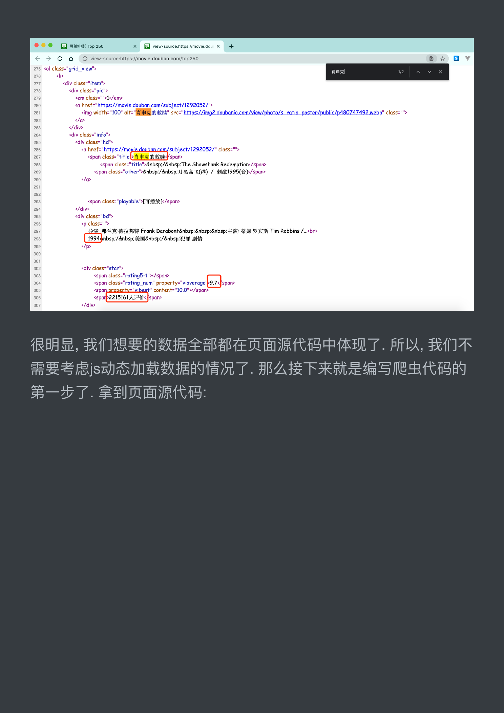

# 手刃豆瓣TOP250电影信息

## 终于可以放开手脚干一番事业了. SAE B te 2 a

### TOP250 排行榜. 没别的意思, 练手而已

© Bi aiter top 250 x 十

EG 读书电影音乐同城小组阅读 FM 时间豆品 Feet

影讯 & 购票。 选电影电视剧。 HGR 分类。 影评。 2020 年度榜单。 2019 书影音报告 aS 年度电影榜单

豆瓣电影 Top 250


```html
e FE] BMH Top 260 fF view-source:https://moviedou x "十
   C © @ view-source:https://movie.douban.com/top250 @* @y
   <div class="item">
    <div class="pic">
     <em class="">1</em>
     <a href="https://movie.douban.com/subject/1292052/">
      
     </o>
    </div>
    <div class="info">
     <div class="hd">
      <a href="https://moyie.douban.com/subject/1292052/" class="">
      <span class="title 2p BRE asa span>
        <span class="title" »4nbsp:/&nbsp; The Shawshank Redemption:/span>
       <span class="other"»&nbsp:/&nbsp: J] ii ECE) / 刺激 1995(台 jx/span>
```

do

```html
 <span class="playable">[7 ik k/spar>
</div>
<div class="bd">
 «p class="
  sk: 弗兰克. 德拉邦特 Frank Darabont&nbsp:&nbsp&nbsp: 主演: #09-38 Ni Tim Robbins /...<br>
```

nbsp:/&nbsp: 美国 &nbsp:/&nbsp: 犯罪剧情

<p

```html
<div class="star">
 <span class="'rating5-t"></span>
 <span property="v:best" content="10.0"%/span
 <sparp2215161 A iF ft<)span>
</div>
```

### 很明显, 我们想要的数据全部都在页面源代码中体现了. 所以, 我们了

```python
人很明显， 门想 Nz =n DL Is a 现。 5 | iS
```

### 需要考虑 js 动态加载数据的情况了. 那么接下来就是编写爬虫代码的

第一步了. 拿到页面源代码:



```python
import requests
```

```python
headers = {
```

}

```python
url = "https://movie.douban.com/top250?
start=0&filters="
resp = requests.get(url, headers=headers)
print(resp.text)
```

然后呢. 从页面源代码中提取我们需要的内容. 这时候我们就可以去

写正则了.

```html
obj = re.compile(r'<Lli>.*?<div class="item">.*?
<div class="pic">.*?<em class="">C?P<num>\d+)
</em>'
                r'.*?<span class="titLe">C?
P<name>.*?)</span>'
                r'.*?<p class="">.*?<br>\nC?
P<year>.*?)&nbsp; '
                r'.*?property="v:average">C?
P<average>.*?)</span>'
                r'.*2<span>C?P<peopLe>\d+) Ai#f{?t
</span>", re.S)
```

### 开始匹配, 将最终完整的数据按照自己喜欢 (需要) 的方式与入文件.

```python
it = obj.finditerCresp.text)
with open("movie.csv", mode="w", encoding="utf-8")
```

as f:

```python
    csvwriter = csv.writer(f) # 创建 csv 文件写入工具，
也可以直接 f.write()
    for item in it:
        dic = item.groupdict()
```

dicL'year'] = dic['year'].stripQ

```python
csvwriter.writerow(dic.vaLlues()) # 5A
```

据

## 代码还有优化空间, 各位可以思考一下如何进一步对代码优化 (时间

### SAE, 空间复杂度), 各位可以自行想办法将豆准 TOP250 条数据全

### 部抓取到. 我这里就偷工减料了. 嘿嘿 ~
