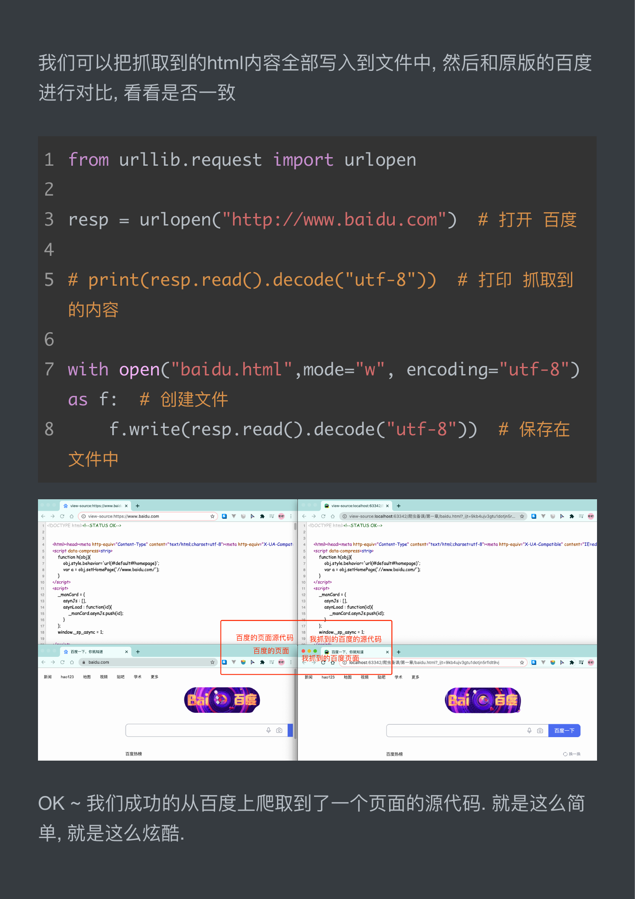

# 手刃一个小爬虫

## 第一个爬虫

### 首先,我们还是需要回顾一下疏虫的概念. 怜虫就是我们通过我们与

### 的程序去抓取互联网上的数据资源. 比如, 此时我需要百度的资源. 在

### 不考虑爬虫的情况下, 我们肯定是打开浏砚器, 然后输入百度的网址，

### 紧接着, 我们就能在浏览器上看到百度的内容了. ABRAM Bie? 其

### 实道理是一样的. 只不过, 我们需要用代码来模拟一个浏览器, 然后同

样的输入百度的网址. 那么我们的程序应该也能拿到百度的内容. 对

### 吧 ~

在 python 中, 我们可以直接用 urllib 模块来完成对浏览器的模拟工作 ~，

直接上代码

```python
from urllib.request import urlopen
```

```python
resp = urlopenC"http://ww.baidu.com") # 打开 BE
print(resp.read().decode("utf-8")) # 打印抓取到的
```

内容

是不是很简单呢?

## 我们可以把抓取到的 html 内容全部写入到文件中, 然后和原版的百度

### 进行对比, 看看是否一致

urllib.request urLopen

```python
resp = urlopencC)
```

```python
open(,mode=，encoding=)
```

f:

```python
f.write(resp.read().decode(»)
```

OK ~ FTO B EMER SS —PS RA IRS. 就是这么简

单, 就是这么炫酷.



你也试一下吧 ~


