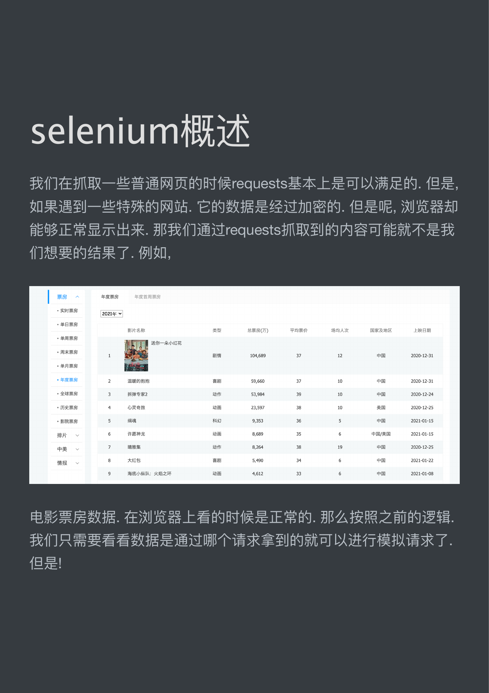
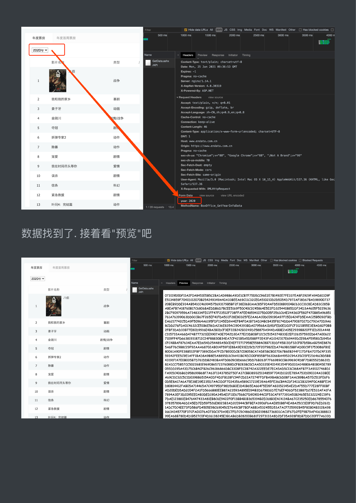
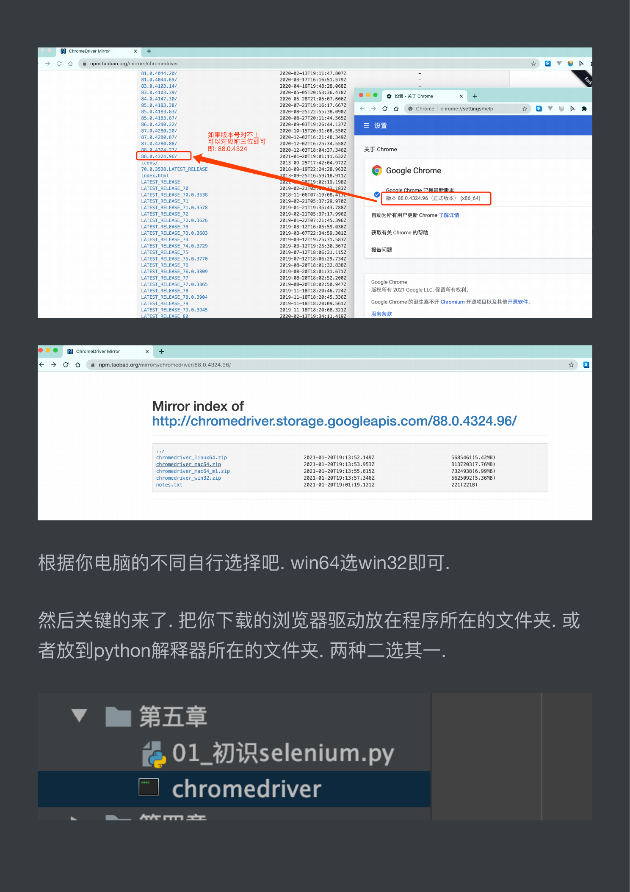
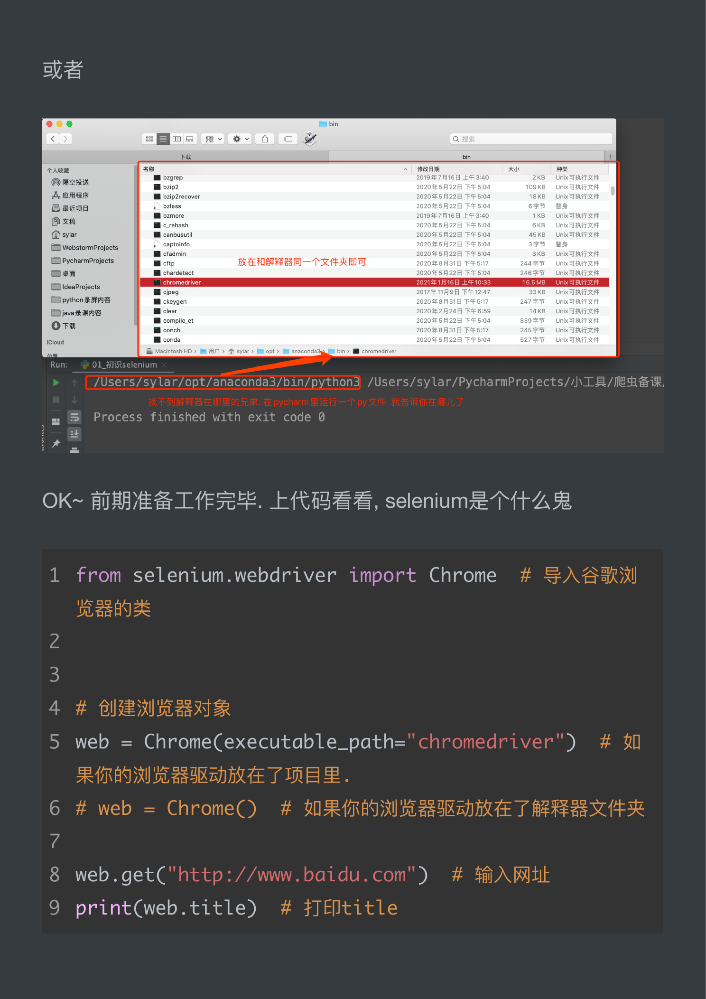

# selenium概述

## selenium 概述

### 我们在抓取一些普通网页的时候 requests 基本上是可以满足的. 但是，

### 如果遇到一些特殊的网站. 它的数据是经过加密的. 但是呢, 浏览器却

### 能够正常显示出来. 那我们通过 requests 抓取到的内容可能就不是我

### 们想要的结果了. 例如，

| 票房从年度票房

### aa 1 oe ei 剧情 104,689 37 12 中国 2020-12-31

oe 6 许愿神龙动画 8,689 35 6 中国 /美国 2021-01-15

中美 7 ase 动作 8,264 38 19 中国 2020-12-25

情报 8 大红包喜剧 5,490 34 6 中国 2021-01-22

电影票房数据. 在浏览器上看的时候是正常的. 那么按照之前的逻辑.

我们只需要看看数据是通过哪个请求拿到的就可以进行模拟请求了.

但是!



Hide data URLs Al JS CSS Img Media Font Doc WS Manifest Other 口 Has blocked cookies

ct 500 ms 1000 ms 1500 ms 2000 ms 2500 ms 3000 ms 3500 ms 4000

```python
FER = <="
```

¥

```python
影片全类型 | Rae Content-Type: text/plain; charset=utf-8
```

Date: Non, 25 Jan 2021 09:36:53 GHT

fi Expires: -1

4B Pragma: no-cache

战争 Server: nginx/1.14.1

X-AspNet-Version: 4.0.30319

Z X-Powered-By: ASP.NET

各和我的东乡 i Request Headers

```python
Accept: text/plain, ¥/*; q=0.01
```

姜子牙动画 'Accept-Encoding: gzip, deflate, br

```python
'Accept-Language: 2h-CN, 2h; q=0.9,en;q=0.8
```

金刚川清 /战争 Cache-Control: no-cache

Connection: keep-ative

an a Content-Length: 46

```python
Content-type: application/x-ww-form-urlencoded; charset=UTF-8
```

拆弹专家 2 动作 cone

Host: www-endata. com. cn

```python
ro 动作 Origin: https://www-endata.com.cn
```

Pragma: no-cache

see-ch-ua-mobile: 70

我在时间尽头等你爱情 Sec-Fetch-Dest: enpty

Sec-Fetch-Mode: cors

误杀剧情 Sec-Fetch-Site: sane-origin

User-Agent: Mozilla/5.0 (Macintosh; Intel Mac 0S X 10_15_4) AppleWebKit/537.36 (KHTML, Like Gec

ut 信条科幻 Safari/537.36

X-Requested-With: XMLHttpRequest

RARE 剧情 Form Data

year: 2020

BH: 完结入动作 ET

Hide data URLs A QIU) JS CSS img Media Font Doc WS Waniest Other [) Has blocked cookies) Blocked Requests

— 500 ms 1000 ms 500 ms 2000 ms 2500 ms 000 ms 9500 ms 4000 ms 4500 ms

sail 型国

073119D5DFllA2FOA8451E5B5C2zBA1AD98B6A9DEICB7F75D5CC96E2E7B1492E7FE337EA8F2929FA94D81109F

全恩 E5134859F7041D112070B254249349A40A33BEEA69C11C32CEOA510210D2D5054D7972AF18D67BAD98900737

ABEAFB7A18760B17C6806BAEDDB6D7BCEE5169F50C40C2C45864E5E2FD325441885DDF34D3A4605F5229636

我和我的家乡 RI EA6217742C5DA9F50964A6195F DF1145ED9A4EFB4FOA1B73AD34BC8435F8174DD6479087027DC792A70D9A6

em BINA 7109FF4FD663819318712C24F88830B34EA7CF42185A5D588FF2E43FAD1142317E69449DCE98AF59581CD945A

CFC4BBAF87634EAA7ED654D254489A50CE4EF72717958E55884C8B713DDF45B13DF32CFB7D5B6AB254E8876

拆弹专家 2 动作 59342FEE5C9E1AFFI1BAD8A9B8E5A8895D3C9A411BC4EC100F855BF563066BA4952C94A35C15FE21646C8D5BB

43191F147E0B035B7D761DDB2483BA4FD0609C8D666C9DD76B263F7F66989CCB69969C4D8F7DB0552D8631D

BR 动作 82A1CC75B57CC50226B1E9690B6572376088DCFB283BC0C1AA50335E401491354F9D033A148B064B1B045E789

宠爱剧情 FA915C406B6D958699B68F7A63F13437852F50FA37CBB389325134859F7041D112CE789A753D090334A33BEE

A69C11C32C5C1D0398865154A0DF4D1FB128FC94FCD22A7274FFDFBA9BABC6D08F3AAC89B6A57EC513FE6F6

我在时间尽头等你爱情 0D5E8A17A6A75E38E39E235D7A4C1D0F7034356A589C17219E39A645FE36CB44CDF3411C1B3294FOCA8BFE34

D80814412FAB05A714465A7C49795DF98D56BOE1D41B65EA664F5E09FA83152145AE2DAF55D777E28FFOOBF

RR 剧情 AD20DED5AD2C04F2A1FD5666B8OEEB87A23593A895E094B3D679816D7E76EF406DF523B87D27E533AFAIFA

7894A3EF3D2095EEOAB3DED190A345AE1F11E67568CFD9090144COF53CAF977393A51B2465E5232224EC19F6

in 信条 ag 7DAE123881EB476447433A81EB8C6E9422F0F13BB4B1B365394B2EC68B3E4C4134BA67C235250ED8678554076

37835789646D2A5ED7ED59F526E8023B3AD2C0944CBFBEFA3906F6AAE851B8F4EABA25CCIEOFID76ED261D

Rese 剧情 1ADC70C4EE73FD586FD4505E98C69045CE7649CBF7BOFA8B1A532455D53A7ACF725992B45F80B04B3128A98

16634345770F37CFA01076A0730C379A9EC7FD7C9C48601E80219882736831CAC3F67D2FEF9B79AF416388813

Tel4. iss 动 99EA68B780D4D1B527COF4D16138245E3B1AB6DB28200B681F2973133A8D2DF35A928F8DB7DDC20FF7A633D



## 我们发现这个数据是经过加密算法的. 这就头疼了. 直接通过

### requests 拿到这些内容必须要解密才能看到真实数据. 但是该网站采

### 用的加密方式又不是那么容易破解. 此时, 各位想想如果我能通过我

### 的程序直接调用浏览右. 让浏览器去解密这些内容. 我们直接拿结果

SRW RK. 哎 ~ 这就引出了我们本章要重点讲解的 selenium 了. CALA

### 完美解决上述问题

### 简单介绍一下 selenium, 它本身是一个自动化测试的工具. 可以启动

### 一个全新的浏览器.并从浏览器中提取到你想要的内容. 随着各种网

VARI MEAL BAI WEN. selenium 越来越受到各位疏 sir 的喜爱.

### selenium 最大的缺点其实就一个, 慢! 你想啊. 他要启动一个第三方的

### 软件 (浏览器), 并且还要等待浏览器把数据泻染完毕. 这个过程必然是

### 很耗时的. 所以它慢.

### 接下来, 我们来聊聊 selenium 如何安装和使用.

就像其他第三方库一样, selenium 直接用 pip 就可以安装了

pip install selenium

但是呢, 它与其他库不同的地方是他要启动你电脑上的浏览器, 这就

需要一个驱动程序来辅助.

chrome 驱动地址:https:/npm.taobao.org/mirrors/chromedriver

这里推荐用 chrome 浏览器. 其他浏览器的驱动请自行百度.

84.0.4147.30, 2020-05-28T21:05:07.606Z 2 & 证 -关于 Chrome x 十

ae Ce © O © Chrome | chrome:/jsettings/help * ay ah 为

87.0.4280.88; 可以对应前三位即可 2020-12-02T16: 25:34.558Z

ap x L BD: 88.0.4324 202@-12-03T18:04:37.346Z 关于 Chrome

70.0,3538. ATEST_RELEASE 2018-09-19722:24:28.9632 © Google Chrome

LATEST_RELEASE_73.0.3683 2019-03-07T22:34:59.301Z 获取有关 Chrome 的帮助

ATEST_RELEASE_75 2019-97-12T18:96:31,115Z 报告问题

ATEST_RELEASE_77.0.3865 2019-08-20T18:02:50.947Z Google Chrome

LATEST_RELEASE_78 2019-11-18T18:20:46.724Z 版权所有 2021 Google LLC. 保留所有权利，

LATEST_RELEASE_79 2819-11-18T18:26:09.561Z Google Chrome 的诞生离不开 Chromium 开源项目以及其他开源软件。

ie BY ChromeDriver Mirror x 十

<> © @ | & npmtaobao.org/mirrors/chromedriver/88.0.4324.96/ * @

Mirror index of

```python
http://chromedriver.storage.googleapis.com/88.0.4324.96/
chromedriver_mac64_m1.zip 2021-01-20T19:13:55.6152 7324938(6.99MB)
chromedriver_win32.zip 2021-01-20T19:13:57.3462 5625092(5.36MB)
```

根据你电脑的不同自行选择吧. win win 可.

尔电脑的不同自行选择 in64 选 win32

然后关键的来了. 把你下载的浏览器驱 = FF

ZB 7A oo x 一、\， #H

01._ 初识 seleni

```python
~~ Arye rTTT =r
```



## 或者

Fe bin +

PARE 名称修改日期大小种类

A 应用程序国 bzip2recover 020 年 5 月 22 日下午 5:04 18KB Unix 可执行文件

- webstommprajects + captoinfo 2020 年 5 月 22 日下午 5:04 3 字节 8S

Ban Wi chardetect 0204 59228 FF 5:04 6 Unix 可执行文

上国 Jdeaprojeets ES 2017 年 11 月 9 日 FF 12:47 33KB "Unix 可执行文件

python RAS 国 ckeygen 2020 年 8 月 31 日下午 5217 247 字节。 Unix 可执行文件

- java 录课内容 Mi clear 2020 年 2 月 24 日下午 6:59 14KB。 Unix 可执行文件

> /Users/sylar/PycharmProjects//\LA/MBSiR,

找不到解释器在哪里的兄弟: 在 PyCharm 里运行一个 py 文件就告诉你在哪儿了

_# ® Process finished with exit code 0

### OK~ 前期准备工作完毕. 上代码看看, selenium 是个什么鬼

```python
from selenium.webdriver import Chrome # 导入谷歌浏
```

```python
# 创建浏览器对象
web = ChromeCexecutable_path="chromedriver") # 如
```

果你的浏览器驱动放在了项目里.

```python
# web = ChromeQ) # 如果你的浏览器驱动放在了解释器文件夹
```

```python
web.get("http://ww.baidu.com") # 输入网址
```

printCweb.title) # 打印 titlLe



\ 一 /一 Ia LS LS 二 hae 以> yy UA oe 一人、

### 运行一下你会发现神奇的事情发生了. 浏览器自动打开了. 并且输入

### 了网址. 也能拿到网页上的 title 标题.

abs; =

```python
£ a from selenium.webdriver import Chrome # 导入谷歌浏览器的类
```

m 2

g 4 # 创建浏览器对象

```python
    web = Chrome(executable_path="chromedriver") # 如果你的浏览器驱动放在了项目里，
四 # web = Chrome() # 如果你的浏览器驱动放在了解释器文件夹
    web.get ("http://www.baidu.com") # 输入网址
```

百度一下， 你就知道 x +

<C @ baiducom * @:

nan 01 初识 selenium Phrome 正受到自动测试软件的控制。 x

Le apts 新闻 haof23 地图直播视频。 贴吧。 学术。 更多 St

百度一下， 你就知道 20

一到 Process finished w

于

|

Cool~
